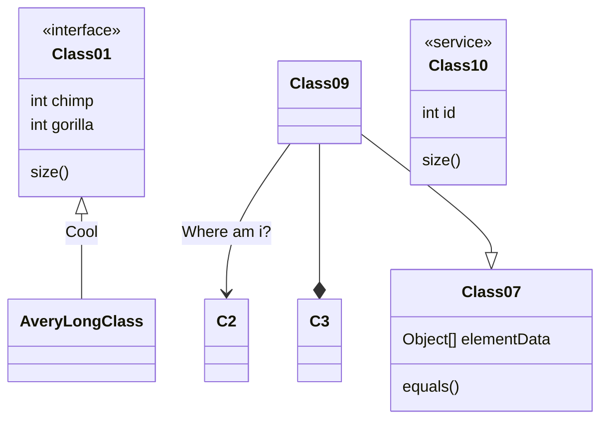

# Hola mundo!
Hola mundo!

## Subtítulo

```bash
sudo apt install neofetch
```

Podemos tener código inline `sudo apt install neofetch`.

### Subsubtitulo

A continuación se muestra un ejemplo de fichero:

```shell
mucho texto
```
{: file="path/to/file" }

### Subsubtitulo

A continuación, muestro un ejemplo de diagrama de clases a partir de código mermaid:


# Hola again

Hola de nuevo viejo

## Subtítulo

A continuación se muestra una imagen con pie de foto.


_Breve descripción de la imágen_