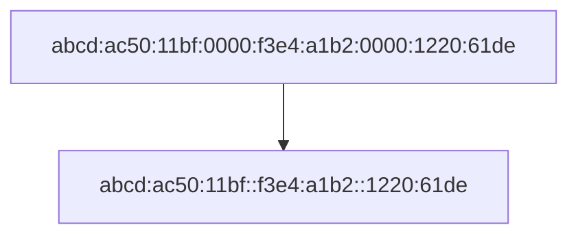
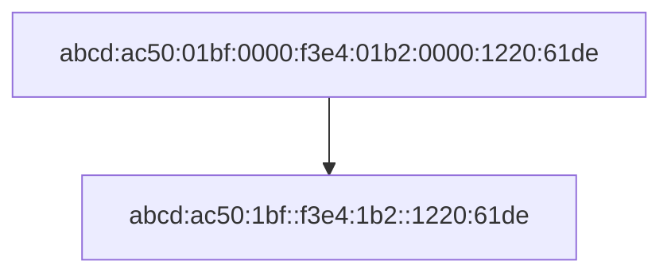

{:.section}
## Antes de nada...

Antes de nada debemos aprender a pasar de binario a hexadecimal y de hexadecimal a binario.

{:.subsection}
### Binario a hexadecimal

<iframe src="https://www.youtube.com/embed/uQaLpYDCkAA" title="YouTube video player" frameborder="0" allow="accelerometer; autoplay; clipboard-write; encrypted-media; gyroscope; picture-in-picture" allowfullscreen></iframe>

{:.question}
¿Qué significa (111)2?

{:.question}
¿Es posible este número :(2)2?

{:.subsection}
### Hexadecimal a binario

Los valores alfanuméricos en hexadecimal son 16: 0, 1, 2, 3, 4, 5, 6, 7, 8, 9, A, B, C, D, E, F.

| Hex | Binary | Hex | Binary |
|:---:|:------:|:---:|:------:|
|     | 0000   | 8   | 1000   |
| 1   | 0001   | 9   | 1001   |
| 2   | 0010   | A   | 1010   |
| 3   | 0011   | B   | 1011   |
| 4   | 0100   | C   | 1100   |
| 5   | 0101   | D   | 1101   |
| 6   | 0110   | E   | 1110   |
| 7   | 0111   | F   | 1111   |

<iframe src="https://www.youtube.com/embed/Wx9X14aVfMg" title="YouTube video player" frameborder="0" allow="accelerometer; autoplay; clipboard-write; encrypted-media; gyroscope; picture-in-picture" allowfullscreen></iframe>

{:.question}
¿Cuáles son todos los símbolos del hexadecimal?

{:.question}
¿Cuanto es (10)16 en base 10? ¿Y (10)16 en decimal? ¿Y (FF)16 en decimal? ¿Y (GG)16 en decimal?

{:.section}
## ¿Qué es IPv6?

IP versión 6 (IPv6) es un protocolo para remplazar a IP versión 4 (IPv4).

El protocolo IPv4 está formado por direcciones IP de 32 bits por lo que da un total de 232= 4.294.967.296 que no cubría todas las posibles conexiones de dispositivos a nivel mundial. Teniendo en cuenta que muchos usuarios se conectan con varios dispositivos necesitan una gran cantidad de IP.

En febrero de 2011 la IANA (Internet Assigned Numbers Authority) **asignó el último bloque** de 33 millones de direcciones a la APNIC, que es la encargada de proporcionar direcciones en Asia. Precisamente, la entrada de este mercado, que posee una gran cantidad de densidad de población, es lo que ha precipitado el final de IPv4 y el uso de IPv6.

| IPv4 | IPv6 |
| --- | --- |
| 32 bits | 128 bits |
| 4 octetos | 16 octetos |
| IPv4 utiliza una dirección de 32 bits	| IPv6 aumenta la dirección a 128 bits. |
| 4.294.967.296 direcciones, (232) | 340.282.366.920.938.463.463.374.607.431.768.211.456 direcciones, (2128) |

IPv6 tiene más de 10.000.000.000.000.000.000.000.000.000 veces más direcciones que IPv4.

_Encabezado IPv6_

{:.section}
## Formato de IPv6

Las direcciones IPv6 están formadas por 128 bits. Para facilitar su anotación se expresan en números hexadecimales agrupados de cuatro en cuatro y cada grupo está separado por dos puntos (:). Las IPv6 se expresan con 32 números hexadecimales. 

Si encontramos un grupo nulo, es decir, todo ceros, podemos comprimir la dirección colocando el  símbolo de dos puntos. Por ejemplo:

Los ceros iniciales de un grupo también se pueden omitir. Por ejemplo:

Las direcciones IPv6 también separan en parte de red y parte de host. 

También pueden usar la notación prefija, es decir, después de una barra inclinada se especifican los bits que pertenecen al prefijo de red. Por ejemplo: la dirección `2010:abcd:ef12::/48` define la red que comienza en el número `2010:abcd:ef12:0000:0000:0000:0000:0000` y finaliza en el número `2010:abcd:ef12:ffff:ffff:ffff:ffff:ffff`.

  
¿Existe la dirección IPv6 9999::9999?

  

    Si.
  

  
¿Existe la dirección IPv6 hhhh::hhhh?

  

    No.
  

  
¿Existe la dirección IPv6 9999:::9999?

  

    No.
  

  
¿Existe la dirección IPv6 FE00::1::56?

  

    No.
  

{:.subsection}
### Ejercicios de expandir y acortar direcciones IPv6

{:.question}
Rellena los siguientes huecos:

|                 Completo                |                Abreviado               |
|:---------------------------------------|:--------------------------------------:|
| 2340:0000:0010:0100:1000:ABCD:0101:1010 |                                        |
|                                         | 30A0:ABCD:EF12:3456:ABC:B0B0:9999:9009 |
| 2222:3333:4444:5555:0000:0000:6060:0707 |                                        |
|                                         | 3210::                                 |
| 210F:0000:0000:0000:CCCC:0000:0000:000D |                                        |
|                                         | 34BA:B:B::20                           |
| FE80:0000:0000:0000:DEAD:BEFF:FEEF:CAFE |                                        |
|                                         | FE80::FACE:BAFF:FEBE:CAFE              |

  
Solución

  

  |                 Completo                |                Abreviado               |
  |:---------------------------------------|:--------------------------------------:|
  | 2340:0000:0010:0100:1000:ABCD:0101:1010 | 2340:0:10:100:1000:ABCD:101:1010       |
  | 30A0:ABCD:EF12:3456:0ABC:B0B0:9999:9009 | 30A0:ABCD:EF12:3456:ABC:B0B0:9999:9009 |
  | 2222:3333:4444:5555:0000:0000:6060:0707 | 2222:3333:4444:5555::6060:707          |
  | 3210:0000:0000:0000:0000:0000:0000:0000 | 3210::                                 |
  | 210F:0000:0000:0000:CCCC:0000:0000:000D | 210F::CCCC:0:0:D                       |
  | 34BA:000B:000B:0000:0000:0000:0000:0020 | 34BA:B:B::20                           |
  | FE80:0000:0000:0000:DEAD:BEFF:FEEF:CAFE | FE80::DEAD:BEFF:FEEF:CAFE              |
  | FE80:0000:0000:0000:FACE:BAFF:FEBE:CAFE | FE80::FACE:BAFF:FEBE:CAFE              |

  

{.section}
## Máscara o prefijo IPv6

IPv6 utiliza un concepto de máscara, llamado **longitud de prefijo**, similar a las máscaras de subred IPv4.

La longitud del prefijo IPv6 se escribe como /, seguida de un número decimal. La longitud del prefijo define **cuántos bits de la dirección IPv6 corresponden al prefijo IPv6**, que es básicamente el mismo concepto que el ID de subred IPv4.

{.subsection}
### Ejercicios para Encontrar la Longitud del Prefijo IPv6

{:.question}
Completa los campos vacíos:

|             Dirección/Longitud            | Prefijo |
|:-----------------------------------------|:-------:|
| 2340:0:10:100:1000:ABCD:101:1010/64       |         |
| 30A0:ABCD:EF12:3456:ABC:B0B0:9999:9009/64 |         |
| 2222:3333:4444:5555::6060:707/64          |         |
| 3210::ABCD:101:1010/64                    |         |
| 210F::CCCC:B0B0:9999:9009/64              |         |
| 34BA:B:B:0:5555:0:6060:707/64             |         |
| 3124::DEAD:CAFE:FF:FE00:1/64              |         |
| 2BCD::FACE:BEFF:FEBE:CAFE/64              |         |

  
Solución

  

|             Dirección/Longitud            |          Prefijo         |
|:-----------------------------------------|:------------------------|
| 2340:0:10:100:1000:ABCD:101:1010/64       | 2340:0:10:100::/64       |
| 30A0:ABCD:EF12:3456:ABC:B0B0:9999:9009/64 | 30A0:ABCD:EF12:3456::/64 |
| 2222:3333:4444:5555::6060:707/64          | 2222:3333:4444:5555::/64 |
| 3210::ABCD:101:1010/64                    | 3210::/64                |
| 210F::CCCC:B0B0:9999:9009/64              | 210F::/64                |
| 34BA:B:B:0:5555:0:6060:707/64             | 34BA:B:B::/64            |
| 3124::DEAD:CAFE:FF:FE00:1/64              | 3124:0:0:DEAD::/64       |
| 2BCD::FACE:BEFF:FEBE:CAFE/64              | 2BCD::/64                |

  

{:.question}
Rellena los siguientes huecos:

|         Longitud/Dirección        |         Prefijo         |
|:---------------------------------|:-----------------------|
| 34BA:B:B:0:5555:0:6060:707/80     |  |
| 3124::DEAD:CAFE:FF:FE00:1/80      |  |
| 2BCD::FACE:BEFF:FEBE:CAFE/48      |  |
| 3FED:F:E0:D00:FACE:BAFF:FE00:0/48 |  |
| 210F:A:B:C:CCCC:B0B0:9999:9009/40 |  |
| 34BA:B:B:0:5555:0:6060:707/36     |  |
| 3124::DEAD:CAFE:FF:FE00:1/60      |  |
| 2BCD::FACE:1:BEFF:FEBE:CAFE/56    |  |

  
Solución

  

|         Longitud/Dirección        |         Prefijo         |
|:---------------------------------|:-----------------------|
| 34BA:B:B:0:5555:0:6060:707/80     | 34BA:B:B:0:5555::/80    |
| 3124::DEAD:CAFE:FF:FE00:1/80      | 3124:0:0:DEAD:CAFE::/80 |
| 2BCD::FACE:BEFF:FEBE:CAFE/48      | 2BCD::/48               |
| 3FED:F:E0:D00:FACE:BAFF:FE00:0/48 | 3FED:F:E0::/48          |
| 210F:A:B:C:CCCC:B0B0:9999:9009/40 | 210F:A::/40             |
| 34BA:B:B:0:5555:0:6060:707/36     | 34BA:B::/36             |
| 3124::DEAD:CAFE:FF:FE00:1/60      | 3124:0:0:DEA0::/60      |
| 2BCD::FACE:1:BEFF:FEBE:CAFE/56    | 2BCD:0:0:FA00::/56      |

  

{:.section}
## Tipos de direcciones IPv6

- **Unicast**: Representa a una única interfaz de red. Los paquetes dirigidos a una dirección unicast se envían a una única interfaz.
- **Anycast**: Identifica a una o más interfaces. Por ejemplo, los servidores que admiten la misma función pueden utilizar la misma dirección IP de unidifusión. Los paquetes enviados a esa dirección IP se reenvían al servidor más cercano según sea  el mejor destino desde el punto de vista de la topología de la red. Las direcciones Anycast son usadas para el balanceo de carga.
- **Multicast**: Representan a un grupo dinámico de hosts. Los paquetes enviados a esta dirección son reenviados por varias interfaces. Las direcciones de Múlticas en IPv6 tienen un propósito similar que en IPv4.

_Tipos de direccionamiento IPv6: Unicast, Anycast y Multicast_

IPv6 usa también direcciones IP públicas como lo hacia IPv4, éstas son las global unicast.

{:.question}
¿Existen IPv6 privadas?

{:.section}
## Direcciones IPv6 especiales

Dentro de las direcciones unicast existen algunas que deben utilizarse nunca:

- La dirección de loopback `0:0:0:0:0:0:0:1` que también puede expresarse como `::1/128`.
- La dirección indefinida `::/128`. Se usa cuando aún no se conoce la dirección IP real de la propia interfaz.
- La dirección local única, expresada como `fc00::/7`. Su uso es similar a las direcciones privadas ipv4.

La IANA es la organización encargada de distribuir el espacio de direcciones de IPv6. Su función principal es la asignación de grandes bloques a los RIR (Registro Regional de Internet), que son unas organizaciones que supervisan la asignación y el registro de recursos de números de Internet dentro de una región particular del mundo. Los recursos incluyen direcciones IP y números de sistemas autónomos.

Las direcciones IPv6 se asignan a las organizaciones en bloques mucho mayores que los de direcciones IPv4.

Debido al formato de número tan grande que utiliza IPv6, se asegura que prácticamente siempre haya direcciones disponibles y, por tanto, el uso de NAT se convierte en innecesario, es decir, que no se hace necesario que los routers tengan que traducir las direcciones de la red interna por otras direcciones en el exterior.

{:.section}
## Coexistencia de IPv4 e IPv6

Actualmente ambas versiones consisten en Internet. Por este motivo, se necesitan mecanismos que permitan dicha coexistencia y una migración progresiva de un protocolo al otro. En general, estos mecanismos pueden clasificarse en tres grupos: 

{:.subsection}
### Pila dual

Esta solución implementa tanto IPv4 como IPv6 en cada nodo de la red. Cada nodo tendrá dos direcciones de red: una IPv4 y otra IPv6.
Es fácil de desplegar y extensamente soportado.
El principal problema es que la topología de red requiere dos tablas de encaminamiento y dos procesos de encaminamiento. Cada nodo en la red necesita tener actualizadas las dos pilas.

_Pila dual_

{:.subsection}
### Túneles

Permite conectar redes IPv6 a través de redes IPv4. Consiste en encapsular paquetes IPv6 en paquetes IPv4. Estos túneles trabajan encapsulando los paquetes IPv6 en paquetes IPv4.

_Túnel IPv4 sobre IPv6_

{:.subsection}
### Traducción

Esta solución es necesaria cuando un nodo que solo soporta IPv4 necesita comunicarse con otro que sólo soporta IPv6. Se realiza una traducción de la cabecera IPv4 a una cabecera IPv6 y viceversa. Es necesario un dispositivo que haga esta traducción.

  
¿Qué dispositivo se encargará de hacer una traducción de IPs incompatibles?

  

    Al igual que con redes IPv4 incompatibles, será un NAT (NAT-PT) el que se encargue de hacer estas traducciones.
  

- **Con estado**: NAT-PT (Network Address Translation - Protocol Translation), TCP-UDP Relay, Socks-based Gateway.
- **Sin estado**: Bump-in-the-Stack, Bump-in-the-API.

_NAT-PT_

## Memes

_No sé cuando empezaré a usar IPv6, pero a estas alturas tengo demasiado miedo de preguntar_

  
¿Cuánto va a durar la transición de IPv4 a IPv6?

  

Durante 20 años se espera que convivan ambas versiones y que la implantación de IPv6 sea paulatina.

_Adopción de IPv6 según Google_

  

_Tamaño del libro de redes vs tamaño del libro de redes si solo se usara IPv6 desde el comienzo_

## Bibliografía

- [Llevamos años escuchando que las IPv4 se han acabado y que IPv6 es el futuro, pero todavía no ha cambiado nada (o eso parece)](https://www.xataka.com/otros/llevamos-anos-escuchando-que-ipv4-se-han-acabado-que-ipv6-futuro-todavia-no-ha-cambiado-nada-eso-parece)
- [Transición IPv4 --> IPv6](http://redesdecomputadores.umh.es/ipv6/Transici%C3%B3n.html)
- [Qué es IPv6](https://ccnadesdecero.com/curso/ipv6/)
