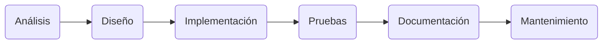
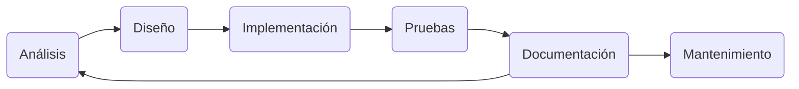
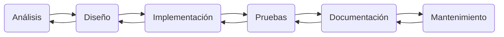
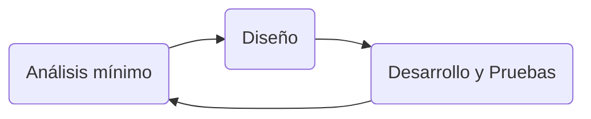
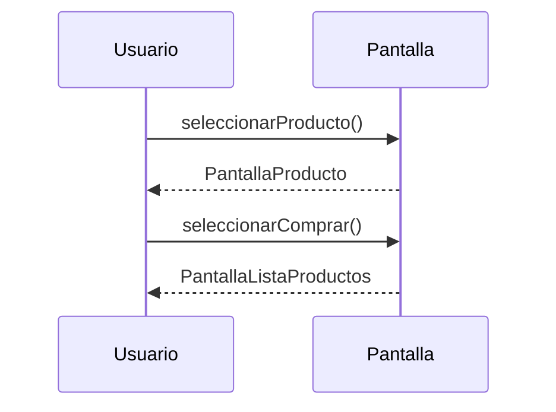
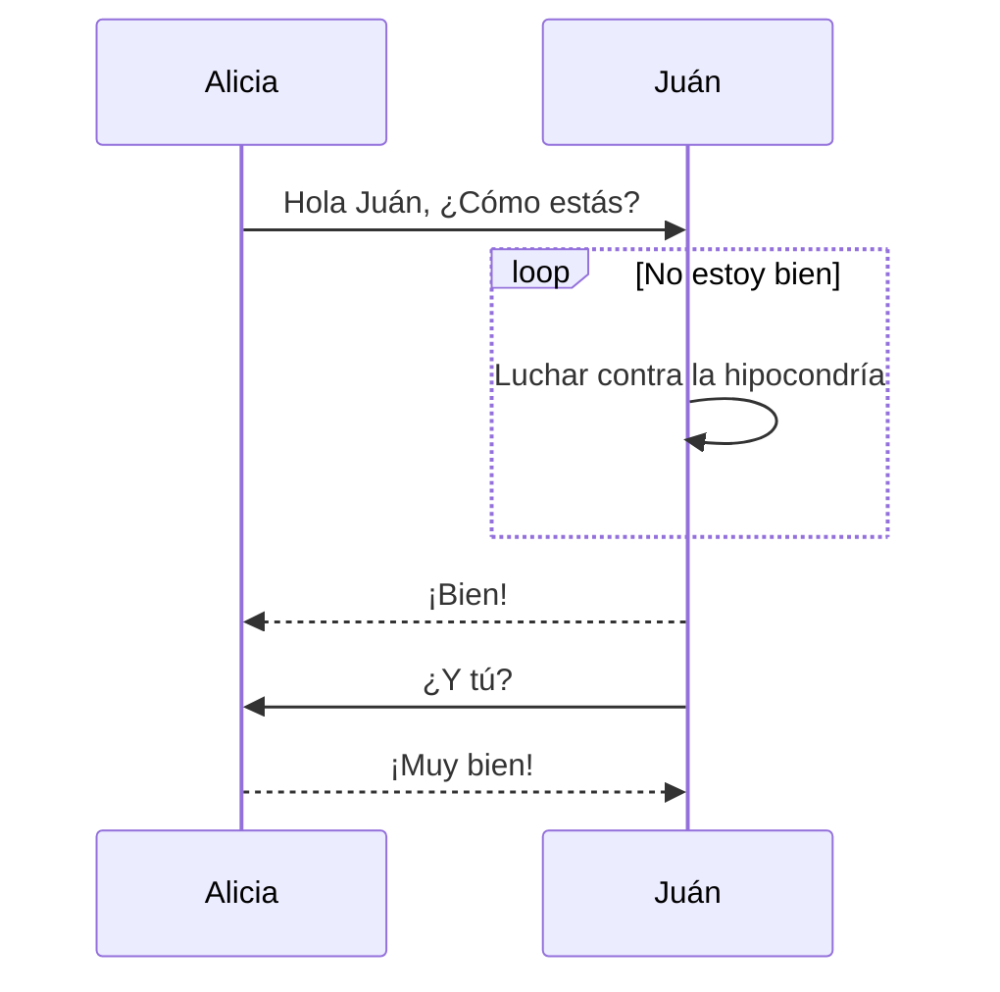

## 1. Introducción

La creación de un programa informático es un proceso ordenado que ha de realizarse de modo secuencial. Desde el programa más sencillo, con pocas instrucciones, hasta la programación de grandes aplicaciones que contienen miles de líneas de instrucciones, se han de seguir una serie de pasos, que constituyen las **etapas del desarrollo de software**:

1. Análisis (de requisitos).
1. Diseño del algoritmo.
1. Implementación o codificación.
1. Pruebas.
1. Documentación.
1. Mantenimiento.

En el el apartado Etapas del desarrollo de software del artículo [Iniciación a la programación](/posts/iniciacion-a-la-programacion/#etapas-del-desarrollo-de-software) están explicadas las fases de desarrollo del software en más detalle.

Teniendo en cuenta las anteriores etapas del desarrollo existen diferentes maneras de organizar estas fases:

- Modelo de cascada
- Modelo de espiral
- Desarrollo iterativo e incremental
- Desarrollo ágil


### 1.1. Modelo de cascada

El modelo de cascada define las etapas que deben cumplirse de forma sucesiva como se ve en el siguiente diagrama.



### 1.2. Crisis del software

**Entre 1960 y 1990** ocurre lo que se denomina la crisis del software en la que ocurrieron casos como los siguientes:

- Accidente de un F-18 (1986) por no poner un else en el if&else.
- Muertes por el Therac-25 (1985-1987): El Therac-25 fue una máquina de radioterapia.
- Sobrecosto, retraso y cancelación en el sistema del Bank of America (1988). 23 millones de $ + **60 millones de $ de sobrecoste**.
  
Debido a esto surgieron nuevos modelos de desarrollo de software.


### 1.3. Modelo de cascada con retroalimentación

El modelo en cascada tiene una serie de variantes con retroalimentación como las dos siguientes:






### 1.4. Modelo de espiral

La principal característica del modelo en espiral es la gestión de riesgos de forma periódica en el ciclo de desarrollo.


_Modelo de espiral_


### 1.5. Desarrollo iterativo e incremental

El desarrollo iterativo recomienda la construcción de secciones reducidas de software que irán ganando en tamaño para facilitar así la detección de problemas de importancia antes de que sea demasiado tarde. Los procesos iterativos pueden ayudar a desvelar metas del diseño en el caso de clientes que no saben cómo definir lo que quieren.


### 1.6. Desarrollo ágil

El desarrollo ágil de software utiliza un desarrollo iterativo como base para abogar por un punto de vista más ligero y más centrado en las personas que en el caso de las soluciones tradicionales. Los procesos ágiles utilizan retroalimentación en lugar de planificación, como principal mecanismo de control. La retroalimentación se canaliza por medio de pruebas periódicas y frecuentes versiones del software. 



Ejemplos:

- **SCRUM**
- FDD (Feature Driven Development)
- TDD (Test Driven Development)
- XP (Extreme programming)


## 2. Análisis

Esta primera etapa es la esencial, pues establecerá las bases del software que comenzaremos a desarrollar.

Sin entrar en grandes aspectos técnicos, se especifican detalladamente en un documento los requisitos que marca el cliente que debe tener el resultado final. La empresa encargada de desarrollarlo también deberá ayudarle a tener una visión completa del software, así como aclararle algunas dudas o ideas que pueda tener el cliente y que puedan parecer en un principio incompletas.

En esta etapa, la comunicación entre la empresa y el cliente es esencial para cerrar las pautas que se deben cumplir y no dejar ningún cabo suelto. Igualmente, la creación de este documento puede ayudar a la empresa a establecer plazos de entrega o costes.

Es importante resaltar que para el correcto proceso de desarrollo de software, este documento debe estar cerrado, sin implementar nuevas pautas a mitad del proceso de desarrollo que puedan retrasar el trabajo.

⚠️ Los diagramas no pertenecen necesariamente a una única etapa del desarrollo de software.


### 2.1. Diagramas de casos de uso


_Ejemplos de diagrama de casos de uso_


### 2.2. Historias de usuario (desarrollo ágil)

Una historia de usuario es una explicación general e informal de una función de software escrita desde la perspectiva del usuario final. Su propósito es articular cómo proporcionará una función de software valor al cliente.

Como \<ROL\>, quiero hacer \<FUNCIONALIDAD\> con el objetivo de \<BENEFICIO\>.


_Ejemplos de historias de usuario_


## 3. Diseño

En esta siguiente fase debemos trazar una estructura interna del software. Para ello, descomponemos y organizamos el sistema en diferentes elementos que puedan elaborarse por separado.

Esto debe dar lugar a la creación de un documento en el que se describe la estructura relacional global del sistema, así como una especificación de cuál es la función de cada una de sus partes o cómo combinan entre ellas.


### 3.1. Diagramas de clases

- El diagrama de clases es un diagrama puramente orientado al modelo de programación orientado a objetos.
- Define las clases que se utilizarán cuando se pase a la fase de construcción y la manera en que se relacionan las mismas.
- Conceptualmente, es similar al modelo Entidad-Relación (E/R).


_Relación persona mascota_

Una Persona tiene una mascota como atributo de clase:

```java
public class Persona{
  private Mascota mascota;
  public Persona(Mascota m){
    mascota = m;
  }
}
```

Una Mascota tiene una persona como atributo de clase:

```java
public class Mascota{
  private Persona persona;
  public Mascota(Persona p){
    persona = p;
  }
}
```
Esto quiere decir que una Persona podrá interactuar con su Mascota en cualquier momento y viceversa.


_Ejemplo de diagrama de clases complejo_


### 3.2. Diagramas de paquetes

Los diagramas de paquetes son diagramas que se emplean para mostrar la organización y disposición de diversos elementos de un modelo en forma de paquetes. Cada elemento está anidado dentro de un paquete, que se representa como una carpeta de archivos dentro del diagrama.

Normalmente un paquete está pensado como un directorio si son componentes internos, pero podría ser también una librería[^librería]. En java las librerías se importan con la palabra clave `import`.

[^librería]: Librería es un false friend de library. Realmente son bibliotecas pero el uso de librería está ampliamente extendido exceptuando ambientes académicos.


_Ejemplo de diagrama de paquetes_


## 4. Implementación

En la etapa de implementación del proceso de desarrollo de software, traducimos el diseño anterior al código. Se programan los requisitos que se han especificado anteriormente, realizando los algoritmos necesarios.

Esta es, por tanto, la primera etapa en la que comenzamos a obtener resultados “visibles”.

Leer el artículo [Manual Java](/posts/manual-java/).


### 4.1. Diagramas de flujo

Un diagrama de flujo es un diagrama que describe un proceso, sistema o algoritmo informático. Se usan ampliamente en numerosos campos para documentar, estudiar, planificar, mejorar y comunicar procesos que suelen ser complejos en diagramas claros y fáciles de comprender.

Son uno de los diagramas más comunes del mundo, usados por personas con y sin conocimiento técnico en una variedad de campos.


_Ejemplo de diagrama de flujo_


### 4.2. Diagramas de secuencia

El diagrama de secuencia muestra gráficamente los eventos que fluyen de los actores al sistema. Para su elaboración se parte de casos de uso elaborados durante la etapa de análisis. Un diagrama de secuencia tiene dos dimensiones:

- La dimensión vertical: que representa el tiempo.
- La dimensión horizontal: que representa los roles que participan en la interacción.






_Ejemplo de diagrama de secuencia complejo_

## 5. Pruebas

Leer el artículo [Prueba de aplicaciones](/posts/prueba-de-aplicaciones/).

## Bibliografía

- [Proceso para el desarrollo de software (Wikipedia)](https://es.wikipedia.org/wiki/Proceso_para_el_desarrollo_de_software)
- [El modelo en cascada: desarrollo secuencial de software](https://www.ionos.es/digitalguide/paginas-web/desarrollo-web/el-modelo-en-cascada/)
- [Historias de usuario con ejemplos y plantilla](https://www.atlassian.com/es/agile/project-management/user-stories)