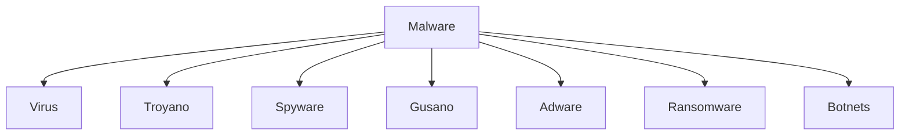

## 1. Introducción

Malware es un término general para referirse a cualquier tipo de "malicious software" (software malicioso) diseñado para infiltrarse en su dispositivo sin su conocimiento. Hay muchos tipos de malware y cada uno busca sus objetivos de un modo diferente.

## 2. Virus

Los virus informáticos son programas que se instalan de forma inadvertida en los ordenadores, realizan su **función destructiva** y pueden propagarse hacia otros ordenadores.

Para que nuestro ordenador se infecte o contagie con un virus, el código del virus tiene que grabarse en nuestro ordenador, la forma más sencilla de hacer esto para un virus es cuando copiamos archivos, ya que sólo tiene que ocultarse dentro del archivo que estamos copiando.

Una vez el archivo del virus está en nuestro ordenador tiene que ejecutarse para poder realizar sus funciones. 

Hay varias formas de ejecutarse, por ejemplo, lo podemos ejecutar nosotros mismos sin darnos cuenta al abrir un archivo adjunto del correo. 

Normalmente las páginas web contienen texto, gráficos, sonido, animaciones y vídeos. El navegador sólo se leen estos elementos y se visualizan en la pantalla, por lo tanto **las páginas web no pueden infectarnos** ya que no suelen contener programas que se ejecuten en nuestro ordenador.

## 3. Troyano

Es un programa aparentemente legítimo e inofensivo, pero que, al ejecutarlo, le brinda a un atacante acceso remoto al equipo infectado. A diferencia de un virus, un troyano no tiene una función destructiva ni se replica a si mismo.

## 4. Spyware

Es un malware que recopila información de un ordenador y después transmite esta información a una entidad externa sin el conocimiento o el consentimiento del propietario del ordenador.

## 5. Gusano

Es un malware que tiene la propiedad de duplicarse a sí mismo, siendo su medio de propagación la red.

A diferencia de los virus necesitan un anfitrión o la interacción humana para propagarse, los gusanos informáticos pueden propagarse muy rápidamente sin la ayuda de estos. Los gusanos son programas autosuficientes que no dependen de la intervención humana para desencadenarse y/o autopropagarse.

_A diferencia de los virus, los gusanos se replican y propagan sin la ayuda de una acción humana_

## 6. Adware

Es un software que muestra publicidad mientras se está utilizando una aplicación sin que el usuario haya consentido en la instalación de dicha publicidad.

## 7. Ransomware

Ransomware es un componente de software malicioso que usa encriptación para impedirle el acceso a sus archivos y tomar a su ordenador de rehén. Antes de poder recuperar el control de su ordenador, puede que tenga que pagar cientos de dólares de rescate. Siga leyendo para aprender más sobre los tipos más comunes de ransomware y la mejor vía de mantener su ordenador a salvo.

## 8. Botnets

Un botnet es un grupo de ordenadores controlados a distancia por un hacker que usa los recursos para llevar a cabo ataques contra páginas web, redes de ordenadores y servicios de internet. Si su ordenador está infectado por un malware, es posible que sea parte de un botnet. Siga leyendo para aprender sobre los ataques más comunes de un botnet y para saber cómo puede proteger su ordenador.

## 9. Bibliografía

- [¿Qué es ransomware? La definición y los 5 tipos principales](https://softwarelab.org/es/que-es-ransomware/)
- [¿Qué es un botnet? La definición y los 5 ejemplos principales](https://softwarelab.org/es/que-es-un-botnet/)