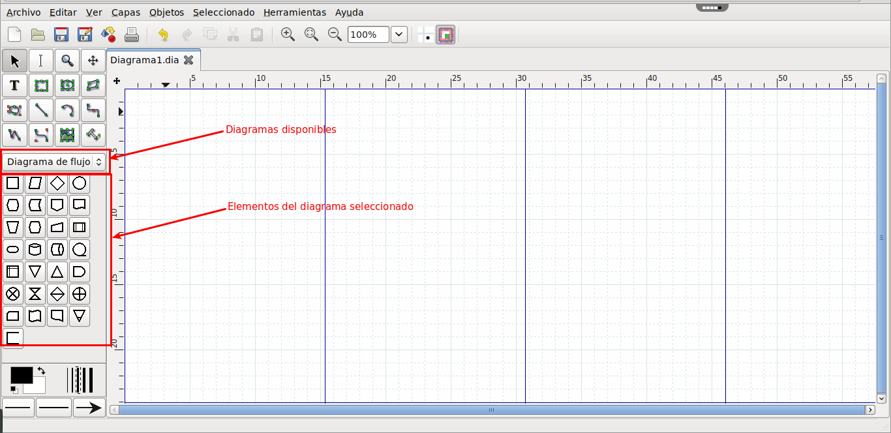

## Introducción

Vamos a crear el diagrama de la universidad que se ha explicado en la página Creación de un diagrama Entidad-Relación, utilizando el programa Dia.

Registrarse en rollApp
Por pasos, primero hay que registrarse en rollApp:

Una vez finalizado el proceso de registro, al acceder se ve una página en donde se muestran unas sugerencias de aplicaciones y se puede buscar la que deseamos utilizar. Para buscar la que queremos hay que pinchar en Apps del menú principal y luego buscar en el buscador de la derecha, como se muestra en la imagen:

Al introducir en el buscador la aplicacion "Dia", nos aparecerán las sugerencias del buscador y hay que seleccionar la aplicación Dia, como muestra la imagen siguiente:

Abrimos esa aplicación y podemos empezara a utilizarla seleccionando "Launch online":

Esto abrirá la aplicación en una nueva ventana:

Una vez abierta la aplicación hay que seleccionar el diagrama que vamos a utilizar del desplegable de diagramas disponibles: ER

Ahora los elementos que aparecen son los del diagrama ER

## Entidad

Para crear una entidad se selecciona el primer elemento, el rectángulo con la E dentro de él, y se pincha sobre la parte del lienzo en la que se desea crear la entidad. Esto crea un cuadro vacío en el que tendremos que poner el nombre de la entidad e ir añadiéndole atributos y relaciones.

Si solo queremos cambiar el nombre de la entidad, basta con pulsar F2 teniendo la entidad seleccionada y nos dejará editar el nombre. Si lo que se desea es abrir todas las propiedades de la entidad, hay que hacer doble clic sobre ella y se abre la ventana de las propiedades:

## Atributos

Para añadir atributos, hay que seleccionar el elemento que es un círculo con una A dentro de él y pinchar en la parte del lienzo en la que se desea crear el atributo. Esto crea una elipse a la que hay que cambiar el nombre y ponerle el nombre del atributo correspondiente. Las propiedades se abren igual que la entidad.

Para indicar que un atributo es clave primaria, bastaría con clicar sobre el botón con etiqueta "Clave".

Para unir los atributos a su entidad, hay que utilizar el elemento que son como dos líneas paralelas. Clicar en el atributo y arrastrar hasta la entidad y entonces soltar. También se puede utilizar una linea normal del los elementos generales, que queda más bonito.

Así tendríamos ya:

## Relaciones

Para añadir relaciones hay que crearlas y luego unirlas, igual que se hace con los atributos.

Una relación se añade con el elemento que es un rombo con una R en él. Se selecciona y se clica sobre la parte del lienzo en la que se desea poner la relación. Y se une a las entidades igual que los atributos. Así, entre Asignatura y Grado, tendremos:

## Cardinalidades

Ahora hay que añadir las cardinalidades. Las de las entidades se añaden desde el cuadro de propiedades de la relación.

Ahora ya tenemos dos entidades con sus atributos y su relación, pero falta la cardinalidad de la relación que, en el caso de la App Dia hay que ponerlo como una etiqueta de texto del cuadro general de elementos:

Con todo esto ya tendríamos toda la relación completa:

Siguiendo los mismo pasos se van añadiendo el resto de entidades y relaciones del diagrama.

## Bibliografía

- <https://libros.catedu.es/books/bases-de-datos-relacionales-y-lenguaje-sql/chapter/modulo-2-diseno-de-una-base-de-datos>