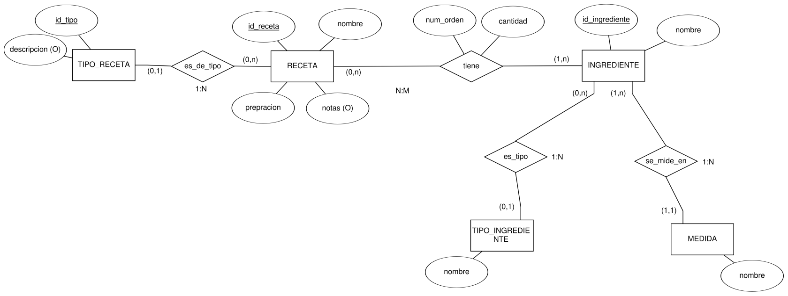
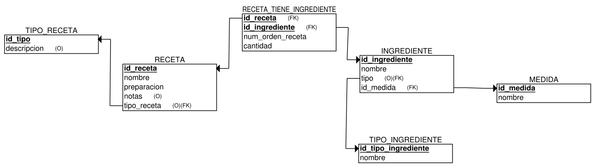
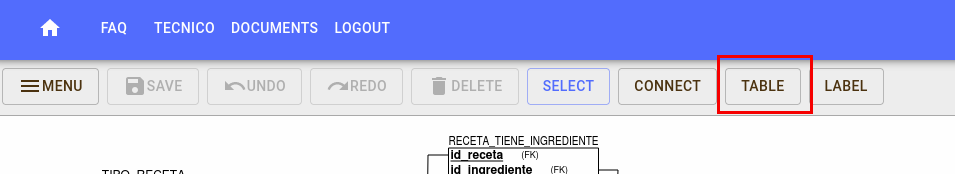
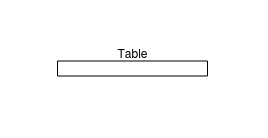
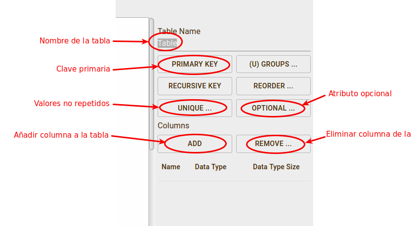
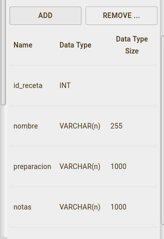
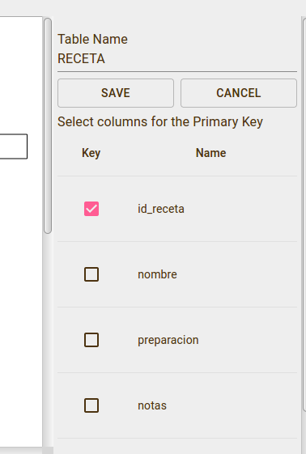
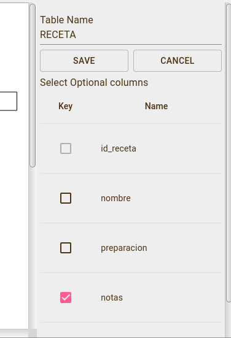
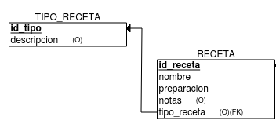

## Introducción

Vamos a ver cómo se crearía un diagrama relacional con la herramienta ERD Plus.

Imaginad que tenemos el diagrama ER siguiente sobre una base de datos de recetas:

_Esquema ER de recetas_

Si diagrama relacional correspondiente es el siguiente:

_Modelo relacional de recetas_

Voy a indicar cómo se crea cada uno de los elementos del diagrama.

## Tablas

Hay que clicar sobre el botón "table":

_Botón de tabla_

A continuación clicar sobre cualquier punto del lienzo de dibujo y se creará una tabla vacía:

_Tabla vacía_

Seleccionando la tabla, a la derecha aparecen todas las opciones de la tabla:

_Propiedades de tabla_

Vamos a crear la tabla Receta.

Tiene 5 columnas, pero una es una clave ajena, así que esa se añade de otra manera que se explica más abajo.

Para añadir las columnas, hay que clicar sobre el botón "ADD" y se abre debajo la ventana con las columnas:

_Columnas de Receta_

Se van rellenando los nombres de las columnas y el tipo de dato como en la imagen de arriba.

Ahora, para indicar la clave primaria, se clica en "PRIMARY KEY" y se abre una ventana con todas las columnas para seleccionar cuáles forman parte de la clave primaria:

_Clave primaria de Receta_

También hay que indicar que la columna notas es opcional (no obligatoria). Para eso clicar sobre "OPTIONAL" y hacer lo mismo que al seleccionar la clave primaria:

_Columnas opcionales de Receta_

Falta solo añadir la clave ajena. Para eso es necesario tener previamente creadas las dos tablas que intervienen en la clave ajena, en este caso la tabla "TIPO_RECETA" y la tabla "RECETA".

Se selecciona el botón "CONNECT" del menú principal y hay que clicar en la tabla cuya clave primaria va a ser clave ajena (TIPO_RECETA) y arrastrar hasta la tabla en la que va a añadirse la columna como clave ajena (RECETA):

_Clave ajena de Receta_

Y la columna se añade sola a la tabla RECETA.

Siguiendo estos mismos pasos para el resto de tablas, se crea el diagrama completo.

## Bibliografía

- <https://libros.catedu.es/books/bases-de-datos-relacionales-y-lenguaje-sql/chapter/modulo-2-diseno-de-una-base-de-datos>