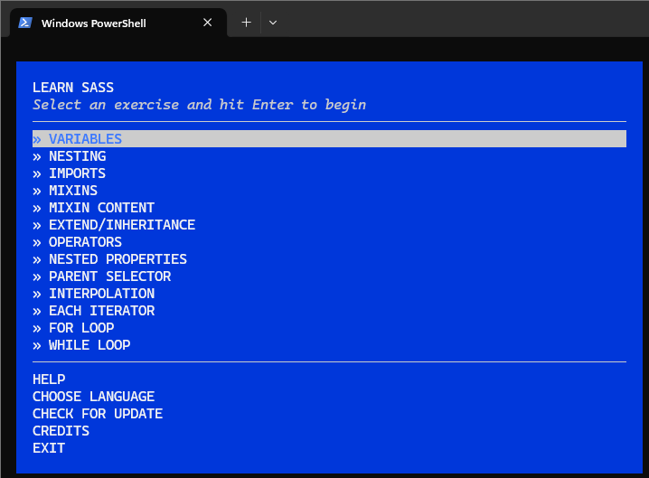

> Artículo en construcción.
{:.prompt-warning}

## Información sobre la tarea

La entrega será en formato PDF. Leer [Entrega y presentación de tareas](/posts/entrega-presentacion-tareas/).

La tarea se calificará con una nota de APTO (10) o NO APTO (0).

Duración actividades obligatorias: 7 horas.

RA2. Crea interfaces web homogéneos definiendo y aplicando estilos.

## Actividades

A continuación, se muestran las actividades a realizar.

{:.activity}
### (Voluntaria) None vs hidden

Imagina un ejemplo de página web en la que al hacerse algo invisible sea mejor usar `display:none` y otro ejemplo en el que sea mejor usar `visibility:hidden`.

{:.activity}
### Flexbox en freeCodeCamp

Hacer el apartado "Aprende CSS Flexbox construyendo una galería de fotos" del curso [Diseño Web Responsivo](https://www.freecodecamp.org/espanol/learn/2022/responsive-web-design/).

> 📷 Cuando termines todos los pasos, haz una captura de tu perfil público y añade el enlace de tu perfil.
{:.prompt-info}

{:.activity}
### (Voluntaria) Flexbox froggy

Haz todas las actividades de [Flexbox Froggy](https://codepip.com/games/flexbox-froggy/).

> 📷 Cuando termines todos los pasos, haz una captura de tu perfil público y añade el enlace de tu perfil público.
{:.prompt-info}

{:.activity}
### (Voluntaria) Tipografía en freeCodeCamp

Hacer el apartado "Aprende tipografía construyendo una etiqueta de nutrición" del curso [Diseño Web Responsivo](https://www.freecodecamp.org/espanol/learn/2022/responsive-web-design/).

> 📷 Cuando termines todos los pasos, haz una captura de tu perfil público y añade el enlace de tu perfil.
{:.prompt-info}

{:.activity}
### (Voluntaria) Pseudoselectores en freeCodeCamp

Hacer el apartado "Aprende más sobre los selectores pseudo de CSS construyendo una hoja de balance" del curso [Diseño Web Responsivo](https://www.freecodecamp.org/espanol/learn/2022/responsive-web-design/).

> 📷 Cuando termines todos los pasos, haz una captura de tu perfil público y añade el enlace de tu perfil.
{:.prompt-info}

{:.activity}
### (Voluntaria) Gato en freeCodeCamp

Hacer el apartado "Aprende CSS Intermedio haciendo una pintura de gatos" del curso [Diseño Web Responsivo](https://www.freecodecamp.org/espanol/learn/2022/responsive-web-design/).

> 📷 Cuando termines todos los pasos, haz una captura de tu perfil público y añade el enlace de tu perfil.
{:.prompt-info}

{:.activity}
### Diseño responsive en freeCodeCamp

Hacer el apartado "Aprende diseño web adaptativo construyendo un piano" del curso [Diseño Web Responsivo](https://www.freecodecamp.org/espanol/learn/2022/responsive-web-design/).

> 📷 Cuando termines todos los pasos, haz una captura de tu perfil público y añade el enlace de tu perfil.
{:.prompt-info}
{:.activity}
### Variables CSS en freeCodeCamp

Hacer el apartado "Aprende variables CSS construyendo un horizonte de la ciudad" del curso [Diseño Web Responsivo](https://www.freecodecamp.org/espanol/learn/2022/responsive-web-design/).

> 📷 Cuando termines todos los pasos, haz una captura de tu perfil público y añade el enlace de tu perfil.
{:.prompt-info}

{:.activity}
### Grid en freeCodeCamp

Hacer el apartado "Aprende la cuadrícula de CSS construyendo una revista" del curso [Diseño Web Responsivo](https://www.freecodecamp.org/espanol/learn/2022/responsive-web-design/).

> 📷 Cuando termines todos los pasos, haz una captura de tu perfil público y añade el enlace de tu perfil.
{:.prompt-info}

{:.activity}
### Grid Garden

Haz todas las actividades de [Grid Garden](https://codepip.com/games/grid-garden/).

> 📷 Cuando termines todos los pasos, haz una captura de tu perfil público y añade el enlace de tu perfil.
{:.prompt-info}

{:.activity}
### Stylelint

Utilizando el tutorial [StyleLint: Linter CSS](https://lenguajecss.com/css/calidad-de-codigo/stylelint/) del todopoderoso MANZ instala y configura en un proyecto llamado `<tu usuario>_t02.2` y comprueba que StyleLint funciona perfectamente. Puedes combinarlo con Error Lens para que muestre los errores en la misma línea de código.

> 📷 Haz una captura de código CSS con errores.
{:.prompt-info}

{:.activity}
### (Voluntaria) SASS

Sigue los pasos de este repositorio <https://github.com/workshopper/learn-sass> para instalar y ejecutar el módulo de learn-sass.

Una vez ejecutes `learn-sass` deberás ver lo siguiente:

_Menú de ejercicios de learn-sass_

Deberás completar los dos primeros ejercicios:

- VARIABLES
- NESTING

> 📷 Haz una captura cuando tengas los dos primeros ejercicios como `[COMPLETED]`.
{:.prompt-info}

> Se recomienda usar la versión de node 8.17.0.
{:.prompt-info}

{:.activity}
### Bootstrap

Descarga los ejemplos de la siguiente página <https://getbootstrap.com/docs/5.3/examples/>.

Abre uno y modifícalo para que aparezca tu código de usuario en algún sitio.

> 📷 Haz una captura cuando termines la actividad.
{:.prompt-info}

## Dame tu feedback

<iframe title="StrawPoll Embed" id="strawpoll_iframe_7rnzV84lDnO" src="https://strawpoll.com/embed/7rnzV84lDnO" style="position: static; visibility: visible; display: block; width: 100%; flex-grow: 1;" frameborder="0" allowfullscreen allowtransparency>Loading...</iframe>

<iframe title="StrawPoll Embed" id="strawpoll_iframe_40Zm41ErRga" src="https://strawpoll.com/embed/40Zm41ErRga" style="position: static; visibility: visible; display: block; width: 100%; flex-grow: 1;" frameborder="0" allowfullscreen allowtransparency>Loading...</iframe>

## Bibliografía

- <https://logongas.es/doku.php?id=clase:daw:diw:1eval:tema01>
- <https://github.com/workshopper/learn-sass>
- <https://lenguajecss.com/css/calidad-de-codigo/stylelint/>
- <https://getbootstrap.com/docs/5.3/examples/>
- 
