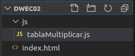

## Introducción

A la hora de diseñar una interfaz web no podemos olvidarnos de la gran cantidad de personas en el mundo que tienen algún tipo de discapacidad. También debemos tener en cuenta a usuarios que tienen un ancho de banda limitado. Esto cobra especial relevancia en los sitios web de instituciones públicas.

  
¿Son las empresas que distribuyen software responsables de la accesibilidad Web?

  

Si.

<!-- Comentario para que no se descuajeringue la cosa -->
  

  
¿Las reglas de accesibilidad son un subconjunto de las reglas de usabilidad?

  

No. Un sistema puede ser accesible pero poco usable.

<!-- Comentario para que no se descuajeringue la cosa -->
  

  
¿Las reglas de usabilidad son un subconjunto de las reglas de accesibilidad?

  

No. Un sistema puede ser usable pero no accesible.

<!-- Comentario para que no se descuajeringue la cosa -->
  

## Tipos de discapacidad

En Junio de 2002, el Real Patronato sobre Discapacidad encargó la realización de un estudio sobre epidemiología de la discapacidad. Los resultados de este estudio son los siguientes:

POBLACIÓN AFECTADA POR LOS DIFERENTES GRUPOS DE DISCAPACIDADES (Datos referidos a personas de 6 y más años)

| Grupo de Discapacidad                                                                                    | Número de personas | Tasa por 1.000 habitantes |
| -------------------------------------------------------------------------------------------------------- | ------------------ | ------------------------- |
| Ver.                                                                                                     | 1.002.290          | 27,1                      |
| Oír.                                                                                                     | 961.348            | 26,0                      |
| Comunicarse.                                                                                             | 359.356            | 9,7                       |
| Aprender, aplicar conocimientos y desarrollar tareas.                                                    | 574.410            | 15,5                      |
| Utilizar brazos y manos.                                                                                 | 1.092.872          | 29,5                      |
| Total personas con discapacidad (una misma persona puede estar en más de una categoría de discapacidad). | 3.478.644          | 93,9                      |

  

¿Qué grupos sociales corren el riesgo de quedar excluidos del acceso a los sitios web debido a obstáculos técnicos?

1. Los ancianos.
1. Las mujeres.
1. Los niños.
1. Las personas con discapacidad.

  

  

Los ancianos y las personas con discapacidad.

Los ancianos es un colectivo que está creciendo mucho y que debido a las limitaciones propias de la edad: falta de destreza en el movimiento (incluso con temblores) o pérdida de agudeza visual o auditiva pueden quedar excluidos del acceso a los sitios web.

Las personas con discapacidad corren el riesgo de quedar excluidos si no se toman medidas en el diseño de páginas web para faciliten el acceso a estas personas.

<!-- Comentario para que no se descuajeringue la cosa -->
  

A continuación describiremos algunos de los tipos de discapacidad que como personas dedicadas al diseño de interfaces Web debemos tener en cuenta para hacer nuestros sitios Web más accesibles y posteriormente veremos las pautas a seguir para poder hacerlo.

### (Voluntario) Visual

Una persona tiene una discapacidad visual cuando tiene disminuida la función visual o bien cuando tiene una ceguera.

Hay muchos tipos de problemas oculares y perturbaciones visuales: visión borrosa, halos, puntos ciegos, moscas volantes, etcétera que pueden estar provocados por una enfermedad ocular u otro tipo de enfermedad que afecte al ojo o, simplemente, por el envejecimiento.

¿Sabias que hay personas que no pueden ver nada en algunas partes de su campo visual?

  
¿Qué es el campo visual? ¿Cuáles son los límites del campo visual?

  

Cantidad de espacio que podemos observar teniendo la vista fija en un punto central situado en el infinito.

_Límites normales del campo visual_

<!-- Comentario para que no se descuajeringue la cosa -->
  

Las personas que tienen problemas de visión pueden haber adquirido éstos:

- De forma repentina debido a un accidente.
- De forma gradual a causa de una enfermedad o por efecto de la edad.
- Tenerlos desde su nacimiento.

### (Voluntario) Motriz

Se dice que una persona tiene una discapacidad motriz cuando padece alguna disfunción en el aparato locomotor. Esta disfunción puede llevar asociados algunos problemas como son:

- Los movimientos limitados o incontrolados.
- La falta de coordinación.
- La falta de fuerza en las extremidades.

  
¿Qué es el aparato locomotor?

  

Es aquel que está formado por los huesos, las articulaciones y los músculos.

<!-- Comentario para que no se descuajeringue la cosa -->
  

Las personas con discapacidad motriz tienen dificultades para enderezar la cabeza, el tronco y las extremidades y tienen problemas para realizar movimientos que requieran un gran control del tono muscular.

  
¿Qué es el tono muscular?

  

Es la contracción parcial, pasiva y continua de los músculos.

<!-- Comentario para que no se descuajeringue la cosa -->
  

### (Voluntario) Auditiva

Las personas con discapacidad auditiva tienen una audición deficiente en ambos oídos. Estas personas se pueden clasificar en dos grandes grupos:

- Personas con **hipoacusia**. Son personas que mediante el uso de prótesis adecuadas son capaces de adquirir por vía auditiva el lenguaje oral.
- Personas con **sordera**. Son personas en las que la visión es su principal canal de comunicación ya que está incapacitado para adquirir la lengua oral por vía auditiva.

La audición es la vía principal a través de la cual se desarrolla el lenguaje y el habla. Un trastorno en la percepción auditiva, en una edad temprana, conlleva un desarrollo  con dificultades para la comprensión lectora y la comprensión de determinadas construcciones sintácticas.

Por ello tenemos que tener en cuenta que una persona con discapacidad auditiva desde su nacimiento, no podrá procesar el lenguaje de la misma forma que una persona sin discapacidad o que una persona que perdió la audición después de aprender a hablar.

### (Voluntario) Cognitiva

  
¿Cuáles son las habilidades cognitivas?

  

Las habilidades cognitivas son un conjunto de operaciones mentales que nos permiten integrar la información que recibimos a través de los sentidos.

<!-- Comentario para que no se descuajeringue la cosa -->
  

Podemos decir que las habilidades cognitivas son aquellas que nos facilitan la adquisición de conocimiento, su retención y su recuperación. Las habilidades cognitivas son las siguientes:

- **Observación**: Todo aquello relacionado con la atención, concentración, búsqueda e identificación de datos, elementos u objetos.
- **Análisis**: Todo aquello relacionado con las habilidades para hacer comparaciones, distinciones con la finalidad de distinguir y destacar los elementos básicos de información.
- **Ordenación**: Todo aquello relacionado con la agrupación, reunión y serialización que permite, a partir de un atributo determinado, disponer un conjunto de datos de forma sistemática.
- **Clasificación**: Todo aquello relacionado con la categorización, esquematización, jerarquización de un conjunto de datos.
- **Representación**: Todo aquello relacionado con la modelización, reproducción o simulación como medio de recreación de nuevos hechos o situaciones a partir de los existentes.
- **Memorización**: Todo aquello relacionado con la retención, conservación, evocación, almacenamiento y recuperación de datos.
- **Interpretación**: Todo aquello relacionado con la argumentación, la deducción y el razonamiento que nos permite aportar un significado personal a la información.
- **Evaluación**: Todo aquello relacionado con la estimación, la crítica y el juicio que nos permite realizar valoraciones sobre los datos obtenidos.

La discapacidad cognitiva de las personas es una disminución de sus habilidades cognitivas. Las causas más conocidas son el Autismo, el Síndrome de Down y el Retraso Mental.

  
¿Qué es el autismo?

  

Trastorno del desarrollo que afecta a la comunicación.

<!-- Comentario para que no se descuajeringue la cosa -->
  

  
¿Qué es el sindrome de down?

  

Trastorno genético caracterizado por la presencia de un grado variable de retraso mental.

<!-- Comentario para que no se descuajeringue la cosa -->
  

  
¿Qué es el retraso mental?

  

Trastorno del desarrollo que lleva asociado un funcionamiento intelectual menor de lo normal con limitaciones en el desempeño de las actividades diarias necesarias para lograr una independencia personal y social.

<!-- Comentario para que no se descuajeringue la cosa -->
  

Las personas con discapacidad cognitiva presentan dificultades en el desarrollo de la inteligencia verbal y matemática, pueden tener un menor rendimiento en la lectura, en la precisión, en la comprensión o en la velocidad, lo que ocasiona trastornos del aprendizaje.

  
Una persona con discapacidad auditiva desde su nacimiento ¿presenta dificultades en el desarrollo de la inteligencia verbal y matemática?

  

No siempre. Las personas con sordera de nacimiento pueden desarrollar su inteligencia verbal con otro medio de comunicación como es el lenguaje de signos. Sí van a tener un menor rendimiento en la lectura o en la comprensión debido a la escasez de vocabulario y a que las frases en el lenguaje de signos se construyen de forma diferente que en el lenguaje oral o el lenguaje escrito.

<!-- Comentario para que no se descuajeringue la cosa -->
  

## Tecnología asistencial

La tecnología asistencial es el conjunto de equipos, dispositivos, instrumentos o programas empleados con la finalidad de mejorar la calidad de vida de aquellas personas que tienen algún tipo de discapacidad incrementando así su autonomía.

La tecnología asistencial ayuda a las personas con discapacidad a realizar tareas que no podrían hacer de otra manera.

Algunos ejemplos de tecnología asistencial son:

- El **perro guía** que acompaña y conduce a las personas ciegas, ayudándoles a cruzar las calles o los perros que están adiestrados para acompañar a personas enfermas.
- **Coches adaptados** para sillas de ruedas o con asientos especiales.
- Las **rampas** en la entrada de los edificios y puertas automáticas facilitan el paso a aquellas personas que se desplazan en silla de ruedas aunque, no cabe duda, que las personas sin discapacidad también se benefician de este tipo de tecnología asistencial.
- Hay **sillas de ruedas** adaptadas para la práctica de deportes como el baloncesto o el tenis.
- El **soporte para libros** permite realizar la lectura con una sola mano.

Las personas ciegas o con discapacidad visual utilizan distintos tipos de tecnología para acceder a la información que se muestra en la pantalla, incluyendo los lectores de pantalla, los dispositivos braille, los ampliadores de pantalla o cualquier combinación de todos ellos mientras que, las personas con discapacidad motriz, utilizan distintos tipos de tecnología asistencial que incluyen, entre otros, los teclados y/o ratones modificados y los sistemas de reconocimiento de voz.

  

Relaciona las siguientes tecnologías asistenciales con el tipo de discapacidad en la que se usan (Cognitiva, Auditiva, Visual o Motriz).:

1. Lector de pantalla.
1. Soporte para libros.
1. Ratón modificado.
1. Dispositivo braille.

  

  

1. Lector de pantalla. → Visual
1. Soporte para libros. → Motriz
1. Ratón modificado. → Motriz
1. Dispositivo braille. → Visual

<!-- Comentario para que no se descuajeringue la cosa -->
  

### Dispositivos de entrada

Los dispositivos de entrada considerados como tecnología asistencial son aquellos que permiten realizar las mismas funciones que se realizarían con un teclado o con un ratón convencional.

Los más conocidos son:

- Teclado virtual
- Teclado alternativo
- Xbox Adaptive Controller
- Teclado Braille
- Software de reconocimiento de voz
- Apuntadores
- Trackball gigante
- Webcams para seguimiento de ojos o cara

#### Teclado virtual

El teclado virtual es un teclado que se muestra en pantalla y que permite escribir textos eligiendo los caracteres con el ratón. Este dispositivo facilita el trabajo a aquellas personas que no pueden usar un teclado con normalidad. Algunos teclados virtuales incorporan un sistema predictivo de palabras con lo cual el esfuerzo para escribir es menor. La mayoría de sistemas operativos ya suministran su propio teclado virtual en pantalla.

_Teclado virtual de Windows 11_

#### Teclado alternativo

Son teclados adaptados a las distintas necesidades. Las adaptaciones realizadas pueden ser:

- Un aumento del tamaño físico de las teclas o del espacio entre las teclas para facilitar su uso por las personas con discapacidad motriz,
- Un aumento del tamaño de las letras escritas sobre la tecla para facilitar la visión a aquellas personas con discapacidad visual
- Un teclado coloreado o con imágenes para facilitar el aprendizaje en las personas con discapacidad cognitiva.

Estos teclados pueden tener una retroalimentación auditiva, indicando mediante el sonido cuál es la tecla pulsada.

_Teclado alternativo_

#### Xbox Adaptive Controller

Es un mando diseñado por Microsoft específicamente para personas con discapacidades o movilidad reducida. Su objetivo principal es hacer que los videojuegos sean más accesibles para todos.

<iframe width="560" height="315" src="https://www.youtube.com/embed/ie7ad7ZLL74?si=WYoWOVeyPfIjmYFJ" title="YouTube video player" frameborder="0" allow="accelerometer; autoplay; clipboard-write; encrypted-media; gyroscope; picture-in-picture; web-share" referrerpolicy="strict-origin-when-cross-origin" allowfullscreen></iframe>

#### Teclado Braille

Es un teclado adaptado para personas ciegas. Los teclados braille suelen tener 6 u 8 teclas principales y algunas teclas auxiliares permitiendo, así, representar cualquier carácter mediante la pulsación simultánea de un número reducido de teclas.

_Teclado Braille_

_Teclado Braille_

#### Software de reconocimiento de voz

Empleado para poder introducir datos o ejecutar comandos en el ordenador a aquellas personas que no pueden hacer uso del teclado ni del ratón. Para ello el ordenador emplea sus funciones de audio. Los sistemas operativos y algunos navegadores ya dan soporte al reconocimiento de voz sin necesidad de instalar un software adicional.

_Windows Speech Recognition_

#### Apuntadores

Los Apuntadores (también llamados licornios) están pensados para aquellas personas que no tienen movilidad en las extremidades pero sí en la cabeza. Es un casco que lleva incorporada una varilla larga acoplada en la frente o en la barbilla y que es empleada para realizar pulsaciones en el teclado. Estos apuntadores deben complementarse con una función conocida como "sticky keys" que permite simular la pulsación simultánea de varias teclas pero pulsándolas de una en una.

_Licornios o apuntadores_

#### Trackball

Es un ratón que no necesita desplazarse. Tiene una bola de gran tamaño situada por encima del ratón que se mueve en cualquier dirección y unos botones de gran tamaño facilitando, de esta forma, su uso por las personas con discapacidad motriz. Algunos disponen de un botón adicional que permite ampliar las imágenes con lo que se convierte en una herramienta útil también para las personas con discapacidad visual.

_Trackball Logitech_

_Trackball Ablenet_

#### Webcams para seguimiento de ojos o cara

Estas webcams están preparadas para transformar el movimiento de los ojos o la cara en movimientos del puntero del ratón en la pantalla simulando las pulsaciones del ratón con un parpadeo o con un gesto concreto de la cara. Estos dispositivos son adecuados para aquellas personas que tienen una discapacidad motriz severa de las extremidades y además tienen dificultad en el habla como para poder emplear el software de reconocimiento de voz.

<iframe width="560" height="315" src="https://www.youtube.com/embed/_qXh8sz9fuI?si=_oVvr6Kg49lCJ5S3" title="YouTube video player" frameborder="0" allow="accelerometer; autoplay; clipboard-write; encrypted-media; gyroscope; picture-in-picture; web-share" referrerpolicy="strict-origin-when-cross-origin" allowfullscreen></iframe>

### Dispositivos de salida

Los dispositivos de salida en un sistema informático son: la pantalla o monitor donde se visualiza la información y los altavoces que reproducen el sonido. Hay que adoptar las medidas necesarias para que las personas con discapacidad auditiva puedan tener acceso a la información sonora y que las personas con discapacidad visual puedan tener acceso a toda la información visual presentada en el monitor. Tampoco hay que olvidar que si la información se suministra además con un lenguaje claro y sencillo, las personas con discapacidad auditiva severa y/o cognitiva no tendrán tantos problemas para comprender dicha información.

Los dispositivos de salida más conocidos empleados como tecnología asistencial son:

- Lectores de pantalla
- Ampliadores de pantalla
- Líneas Braille

#### Lectores de pantalla

Son programas especialmente útiles para las personas con ceguera o con una discapacidad visual muy grande ya que permiten hacer una lectura de lo que se muestra por pantalla mediante un sintetizador de voz. Existen diferentes lectores:

- Narrador: integrado en Windows.
- [Voice Aloud Reader](https://play.google.com/store/search?q=voice%20aloud%20reader&c=apps&hl=es) 🔥: para leer ficheros EPUB, Web y PDF.
- [NVDA](https://www.nvaccess.org/download/) (NonVisual Desktop Access): Gratuito y de código abierto.

_Narrador de Windows 11_

_Voice Aloud Reader_

<iframe width="560" height="315" src="https://www.youtube.com/embed/8ZKlKAAh6HI?si=dK9J97CTg9FhXnhw" title="YouTube video player" frameborder="0" allow="accelerometer; autoplay; clipboard-write; encrypted-media; gyroscope; picture-in-picture; web-share" referrerpolicy="strict-origin-when-cross-origin" allowfullscreen></iframe>

#### Ampliadores de pantalla

Son programas especialmente útiles en las personas con baja visión ya que permiten ampliar el texto y las imágenes mostrados en el monitor. En este apartado tenemos como ejemplo la lupa que suministran algunos sistemas operativos.

_Aplicación de lupa de Windows 11_

#### Líneas Braille

Están compuestas por una serie de celdas con 6 u 8 puntos cada una que muestran de forma táctil la misma información que leería un lector de pantalla. Son útiles para las personas ciegas y, sobre todo, para las sordo-ciegas que no se pueden beneficiar de los lectores de pantalla ni de los ampliadores de pantalla.

_Lineas Braille_

  
¿cómo puedes tú (como persona dedicada al diseño web) contribuir a la accesibilidad en la web?

  

- Empleando un código XHTML semánticamente correcto.
- Proporcionando un texto descriptivo alternativo a las imágenes.
- Dando nombres significativos a los enlaces para que puedan ser leídos correctamente por los lectores de pantalla.
- Subtitulando los vídeos facilitaremos su comprensión por parte de las personas con discapacidad auditiva.
- Empleando un lenguaje claro y sencillo facilitaremos su comprensión a las personas con discapacidad cognitiva y aquellas con una discapacidad auditiva severa adquirida en una edad muy temprana.
- Eligiendo un tamaño de letra grande con un buen contraste con el fondo y una adecuada combinación de colores facilitaremos la lectura a las personas con baja visión.
- Creando elementos de interacción lo suficientemente grandes facilitaremos a las personas con alguna discapacidad motriz el poder interactuar con una página.

<!-- Comentario para que no se descuajeringue la cosa -->
  

{.question}
¿Crees que mi web cumple todos estos requisitos de accesibilidad?

  
¿Los "sticky keys" son teclas especiales de gran tamaño que pueden verse mejor?

  

No. La función de las "sticky keys" es simular la pulsación simultánea de varias teclas pero pulsándolas de una en una.

<!-- Comentario para que no se descuajeringue la cosa -->
  

## Estándares de accesibilidad del W3C

El W3C (World Wide Web Consortium) es una comunidad internacional que desarrolla estándares que aseguran el crecimiento de la Web a largo plazo.

Entre los estándares creados por este consorcio destacan:

- **HTML5**: Proporciona la estructura semántica del contenido. Esta versión añade elementos como: `<header>`, `<nav>`, `<main>`, `<article>`, etc.
- **CSS3**: Permite controlar el diseño visual: colores, tipografía, diseño responsivo, animaciones, etc. Esta versión es la que incluye estándares como grid, flex y media queries.
- **DOM**: Permite la manipulación dinámica de la estructura del documento HTML/CSS con JavaScript.

Pero también incluye estándares centrados en la accesibilidad:

- **WCAG**: Directrices para crear interfaces accesibles para personas con discapacidad.

Nos centraremos en este último en su versión 2.0.

### WCAG 2.0

La Iniciativa para la Accesibilidad Web (WAI) es una iniciativa que desarrolla estrategias, directrices y recursos para ayudar a hacer la Web accesible a las personas con discapacidad. Concretamente, la WAI desarrolla las Directrices de Accesibilidad para el Contenido Web (WCAG).

Las WCAG 2.0 se han diseñado para ser aplicadas a una amplia gama de tecnologías Web ahora y en el futuro, y para ser verificables con una combinación de pruebas automatizadas y de evaluación humana.

Las directrices o pautas y los criterios de éxito se basan cuatro principios:

1. **Perceptibilidad**: Los componentes de la interfaz de usuario deben estar presentados de tal manera que los usuarios lo puedan percibir. Esto significa que los usuarios deben ser capaces de percibir la información que se presenta, es decir, la información no puede ser invisible para todos los sentidos del usuario.
1. **Operabilidad**:Los componentes y la navegación de la interfaz de usuario deben ser operables, es decir, la interfaz no puede exigir una interacción que a un usuario le sea imposible de realizar.
1. **Comprensibilidad**: Los usuarios deben ser capaces de comprender la información, así como el funcionamiento de la interfaz de usuario.
1. **Robustez**: El contenido debe poder ser interpretado de manera fiable por una amplia variedad de aplicaciones de usuario, incluidas las ayudas técnicas.

Si alguno de estos principios no se cumple, los usuarios con discapacidad no podrán utilizar la Web.

  

¿Cuál es la misión de la W3C?

1. Controlar que las páginas Web publicadas en Internet cumplen con los estándares.
1. Desarrollar especificaciones.
1. Desarrollar líneas maestras.
1. Desarrollar hardware adaptado.

  

Desarrollar especificaciones y Desarrollar líneas maestras.

<!-- Comentario para que no se descuajeringue la cosa -->
  

### Pautas de accesibilidad de las WCAG 2.0

Las Pautas de Accesibilidad para el Contenido Web definen cómo crear contenidos web más accesibles para las personas con discapacidad.

Aunque estas pautas cubren un amplio rango de discapacidades, no son suficientes para satisfacer las necesidades de personas con todos los tipos, grados y combinaciones de discapacidad posibles. Estas pautas también ayudan a que el contenido sea más usable para las personas mayores, que ven sus habilidades reducidas a causa de la edad y, a menudo, mejoran la usabilidad para los usuarios en general.

Las WCAG 2.0 tienen 12 pautas que se organizan en los cuatro principios que constituyen los principios generales del diseño accesible mencionados ya en el apartado anterior: perceptible, operable, comprensible y robusto.

1. **Perceptibilidad**
   1. Proporcionar alternativas textuales para todo el contenido no textual (imágenes, mapas, enlaces, botones), de manera que pueda modificarse para ajustarse a las necesidades de las personas.
   1. Proporcionar alternativas sincronizadas para contenidos multimedia sincronizados dependientes del tiempo.
   1. Crear contenido que pueda ser presentado de diferentes maneras y sin perder la información ni su estructura.
   1. Facilitar a los usuarios la visión y la audición del contenido.
1. **Operabilidad**
   1. Hacer que toda la funcionalidad esté disponible desde el teclado.
   1. Dar a los usuarios el tiempo suficiente para leer y usar el contenido.
   1. No diseñar contenido que pueda causar convulsiones.
   1. Proporcionar medios que sirvan de ayuda a los usuarios a la hora de navegar, localizar contenido y determinar dónde se encuentran.
1. **Comprensibilidad**
   1. Hacer que el contenido textual sea legible y comprensible.
   1. Crear páginas web cuya apariencia y operabilidad sean predecibles.
   1. Ayudar a los usuarios a evitar los errores y a corregirlos.
1. **Robustez**
   1. Maximizar la compatibilidad con los agentes de usuario actuales y futuros, incluyendo las tecnologías asistivas.

### Niveles de conformidad de las WCAG 2.0

Para cada pauta se proporcionan los criterios de éxito verificables que permiten emplear las WCAG 2.0 en aquellas situaciones en las que existan requisitos y necesidad de evaluación de conformidad. Existen tres niveles:

- **Nivel A**: Para lograr conformidad con el nivel A, la página web satisface todos los criterios de éxito del nivel A, o proporciona una versión alternativa conforme al nivel A.
- **Nivel AA**: Para lograr conformidad con el nivel AA, la página web satisface todos los criterios de éxito de los niveles A y AA, o se proporciona una versión alternativa conforme al nivel AA.
- **Nivel AAA**: Para lograr conformidad con el nivel AAA, la página web satisface todos los criterios de éxito de los niveles A, AA y AAA, o proporciona una versión alternativa conforme al nivel AAA.

  
¿Para lograr conformidad con el nivel AAA, la página web debe satisfacer únicamente todos los criterios de éxito del nivel AAA?

  

No. Lograr un nivel superior implica haber logrado los niveles anteriores.

<!-- Comentario para que no se descuajeringue la cosa -->
  

### Criterios de conformidad de la WCAG 2.0

Cada pauta de accesibilidad tiene de uno a diez criterios de éxito.

Un criterio de éxito es una afirmación comprobable que puede ser verdadera o falsa cuando se aplica a un contenido web específico.

Cada criterio de éxito incluye su intención, los términos clave que se utilizan en el criterio de éxito, y cómo los criterios de éxito pueden ayudar a la gente con diferentes tipos de discapacidad.

Cada criterio de éxito tiene asociado un único nivel: A, AA o AAA.

#### Ejemplo de criterio de conformidad

**Principio 1. Perceptibilidad > Pauta 1. Alternativas textuales > Criterio de conformidad 1. Contenido no textual (Nivel A)**

La intención de este criterio de éxito es hacer que la información transmitida por los contenidos no textuales sea accesible a través del uso de un texto alternativo.

Las alternativas de texto pueden ser visuales, auditivas o táctiles.

Por ejemplo:

- Una persona que no puede ver una imagen puede tener un texto alternativo que puede ser leído en voz alta utilizando un sintetizador de voz.
- Una persona que no puede oír un archivo de audio puede tener un texto alternativo que se muestra para ser leído. Los textos alternativos también permiten que la información sea más fácil de traducir al lenguaje de signos.

Este criterio de éxito ayuda a las personas con dificultades para percibir el contenido visual.

También pueden ayudar a las personas con dificultades para comprender el significado de las fotografías, dibujos y otras imágenes, gráficos, tablas, animaciones, etcétera.

Las personas sordas o con problemas de audición, pueden leer el texto alternativo.

Las personas sordo ciegas pueden leer el texto en braille.

> (Voluntario) Si quieres conocer todos los 61 criterios de conformidad puedes leer el artículo [Criterios de conformidad de WCAG 2.0](https://accesibilidadweb.dlsi.ua.es/?menu=criterios-2.0).
{:.prompt-info}

### Técnicas de accesibilidad

Para cada uno criterios de conformidad, el grupo de trabajo de las WCAG 2.0 ha documentado también una amplia variedad de técnicas.

(Voluntario) En el artículo [Techniques and Failures for Web Content Accessibility Guidelines 2.0](https://www.w3.org/TR/2010/NOTE-WCAG20-TECHS-20101014/complete.html#G1)n tienes descritas las 375 técnicas en inglés.

### Declaración de conformidad de documentos Web

Una declaración de conformidad de una página web conforme con las WCAG 2.0 (Web Content Accessibility Guidelines 2.0) es un documento (generalmente público) en el que el responsable del sitio web afirma que este cumple con los requisitos de accesibilidad establecidos en las WCAG 2.0.

La declaración de conformidad deberá satisfacer los siguientes requisitos:

1. Nivel de conformidad alcanzado: Puede ser A, AA o AAA.
1. Versión de las WCAG usada.
1. Alcance de la conformidad: Indica a qué páginas o secciones del sitio se aplica.
1. Método de verificación: Interna, externa. Con uso de herramientas automáticas + manuales o solo manuales.
1. Fecha de la última revisión.
1. Información de contacto.

## Herramientas de evaluación de la accesibilidad

Normalmente, el proceso de evaluación de la Accesibilidad del contenido Web que consta de dos fases:

1. En primer lugar se debe realizar un análisis automático que detecte los problemas de accesibilidad. Las herramientas automáticas han de entenderse como una ayuda en el proceso de evaluación y no como un análisis completo ni infalible.
1. Como complemento de la evaluación automática ha de realizarse una evaluación manual para identificar todos aquellos problemas que no pueden ser comprobados en la primera fase y revisar aquellos dudosos que requieren de pruebas adicionales para su comprobación completa.

Las herramientas que existen para la evaluación de la accesibilidad son:

1. <https://validator.w3.org/>
1. <https://wave.webaim.org/>
1. Extensión [Lighthouse](https://chromewebstore.google.com/detail/lighthouse/blipmdconlkpinefehnmjammfjpmpbjk?hl=es) de Google.
1. Extensión [axe DevTools](https://chromewebstore.google.com/detail/axe-devtools-web-accessib/lhdoppojpmngadmnindnejefpokejbdd).

{:.question}
¿Este artículo tiene algún fallo de accesibilidad según alguna de las herramientas mencionadas?

## Bibliografía

- <http://codexexempla.org/curso/curso_4_5.php>
- <https://wave.webaim.org/>
- <https://idrc.ocadu.ca/>
- <https://www.w3.org/WAI/standards-guidelines/wcag/es>
- <https://accesibilidadweb.dlsi.ua.es/?menu=criterios-2.0>
