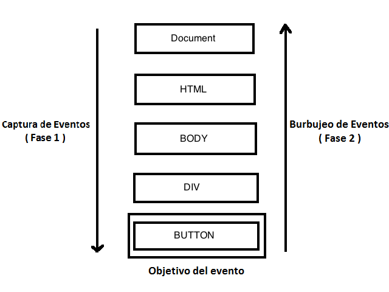

> Artículo en construcción.
{:.prompt-warning}

## Introducción

A la hora de diseñar una interfaz web no podemos olvidarnos de la gran cantidad de personas en el mundo que tienen algún tipo de discapacidad. También debemos tener en cuenta a usuarios que tienen un ancho de banda limitado. Esto cobra especial relevancia en los sitios web de instituciones públicas.

  
¿Son las empresas que distribuyen software responsables de la accesibilidad Web?

  

Si.

<!-- Comentario para que no se descuajeringue la cosa -->
  

## Tipos de discapacidad

En Junio de 2002, el Real Patronato sobre Discapacidad encargó la realización de un estudio sobre epidemiología de la discapacidad. Los resultados de este estudio son los siguientes:

POBLACIÓN AFECTADA POR LOS DIFERENTES GRUPOS DE DISCAPACIDADES (Datos referidos a personas de 6 y más años)

| Grupo de Discapacidad                                                                                    | Número de personas | Tasa por 1.000 habitantes |
| -------------------------------------------------------------------------------------------------------- | ------------------ | ------------------------- |
| Ver.                                                                                                     | 1.002.290          | 27,1                      |
| Oír.                                                                                                     | 961.348            | 26,0                      |
| Comunicarse.                                                                                             | 359.356            | 9,7                       |
| Aprender, aplicar conocimientos y desarrollar tareas.                                                    | 574.410            | 15,5                      |
| Utilizar brazos y manos.                                                                                 | 1.092.872          | 29,5                      |
| Total personas con discapacidad (una misma persona puede estar en más de una categoría de discapacidad). | 3.478.644          | 93,9                      |

  

¿Qué grupos sociales corren el riesgo de quedar excluidos del acceso a los sitios web debido a obstáculos técnicos?

1. Los ancianos.
1. Las mujeres.
1. Los niños.
1. Las personas con discapacidad.

  

  

Los ancianos y las personas con discapacidad.

Los ancianos es un colectivo que está creciendo mucho y que debido a las limitaciones propias de la edad: falta de destreza en el movimiento (incluso con temblores) o pérdida de agudeza visual o auditiva pueden quedar excluidos del acceso a los sitios web.

Las personas con discapacidad corren el riesgo de quedar excluidos si no se toman medidas en el diseño de páginas web para faciliten el acceso a estas personas.

<!-- Comentario para que no se descuajeringue la cosa -->
  

A continuación describiremos algunos de los tipos de discapacidad que como personas dedicadas al diseño de interfaces Web debemos tener en cuenta para hacer nuestros sitios Web más accesibles y posteriormente veremos las pautas a seguir para poder hacerlo.

### Visual

Una persona tiene una discapacidad visual cuando tiene disminuida la función visual o bien cuando tiene una ceguera.

Hay muchos tipos de problemas oculares y perturbaciones visuales: visión borrosa, halos, puntos ciegos, moscas volantes, etcétera que pueden estar provocados por una enfermedad ocular u otro tipo de enfermedad que afecte al ojo o, simplemente, por el envejecimiento.

¿Sabias que hay personas que no pueden ver nada en algunas partes de su campo visual?

  
¿Qué es el campo visual? ¿Cuáles son los límites del campo visual?

  

Cantidad de espacio que podemos observar teniendo la vista fija en un punto central situado en el infinito.

_Límites normales del campo visual_

<!-- Comentario para que no se descuajeringue la cosa -->
  

Las personas que tienen problemas de visión pueden haber adquirido éstos:

- De forma repentina debido a un accidente.
- De forma gradual a causa de una enfermedad o por efecto de la edad.
- Tenerlos desde su nacimiento.

### Motriz

Se dice que una persona tiene una discapacidad motriz cuando padece alguna disfunción en el aparato locomotor. Esta disfunción puede llevar asociados algunos problemas como son:

- Los movimientos limitados o incontrolados.
- La falta de coordinación.
- La falta de fuerza en las extremidades.

  
¿Qué es el aparato locomotor?

  

Es aquel que está formado por los huesos, las articulaciones y los músculos.

<!-- Comentario para que no se descuajeringue la cosa -->
  

Las personas con discapacidad motriz tienen dificultades para enderezar la cabeza, el tronco y las extremidades y tienen problemas para realizar movimientos que requieran un gran control del tono muscular.

  
¿Qué es el tono muscular?

  

Es la contracción parcial, pasiva y continua de los músculos.

<!-- Comentario para que no se descuajeringue la cosa -->
  

## Bibliografía

- <http://codexexempla.org/curso/curso_4_5.php>
- <https://wave.webaim.org/>
- <https://idrc.ocadu.ca/>
