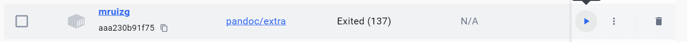
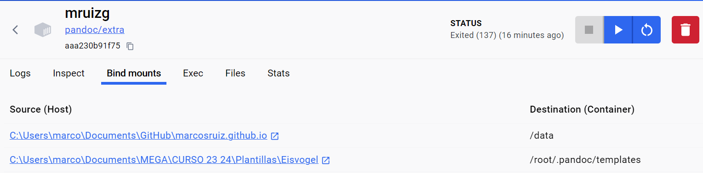

## Ejecutar el script exportarMdAPdf.ps1

Para ejecutar el script `exportarMdAPdf.ps1` primero debemos estar en una máquina Windows y tener el contenedor `pandoc/extra` instalado y corriendo.


_Contenedor de pandoc/extra_


_Volumenes de pandoc/extra_

Posteriormente, en el terminal de Windows, deberemos situarnos en la raíz del proyecto. En este caso en la carpeta `marcosruiz.github.io` y ejecutar el comando:

```console
.\pandoc\exportarMdAPdf.ps1
```

## Editar el script exportarMdAPdf.ps1

En el script `exportarMdAPdf.ps1` podemos realizar los siguientes cambios:

1. Modificar la variable `patrones` para añadir más patrones. Normalmente aquí se borrarán todos los emojis que den problemas para que no falle la creación del PDF.
1. Modificar la variable `routes` para indicar que artículos queremos transformar en PDF.
1. Modificar el ID del contenedor de docker si ejecutas el código en un ordenador que no sea mi Lenovo Yoga.
